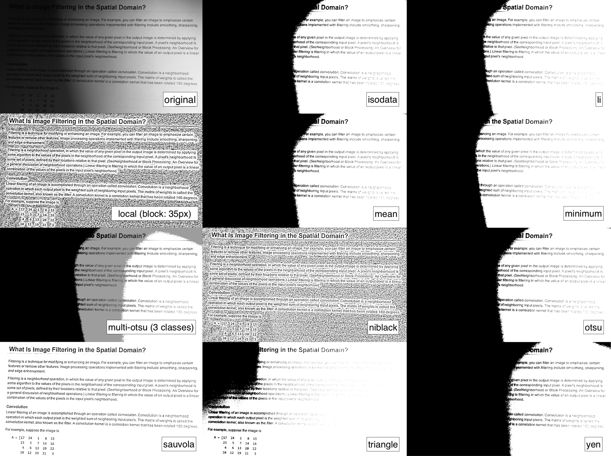

# img2bw

**img2bw** is a simple command-line application to binarize images.

**Supported binarizers:** otsu, isodata, li, local, mean, minimum, multiotsu, niblack, sauvola, triangle, yen.




## Requirements

- Python3


## Installation

Open the terminal, go to the folder of this package and type:

```
python setup.py install --user
```


## Usage


To binarize a single image, type:

```
img2bw example.jpg --method try-all
```

To binarize all the images in a directory, type:

```
img2bw input_dir/ --output output_dir/
```


### More options

To view all the available options, type `img2bw --help` in the terminal:

```
usage: img2bw [-h] [--output OUTPUT]
              [--output-ext {jpg,jpeg,jfif,png,tiff,bmp,pnm}]
              [--method {otsu,isodata,li,local,mean,minimum,multiotsu,niblack,sauvola,triangle,yen,try-all}]
              [--block-size BLOCK_SIZE] [--num-classes NUM_CLASSES]
              input

positional arguments:
  input                 Input file or directory

optional arguments:
  -h, --help            show this help message and exit
  --output OUTPUT       Output file or directory
  --output-ext {jpg,jpeg,jfif,png,tiff,bmp,pnm}
                        Output file extension
  --method {otsu,isodata,li,local,mean,minimum,multiotsu,niblack,sauvola,triangle,yen,try-all}
                        Method used to perform the binarization
  --block-size BLOCK_SIZE
                        Odd size of pixel neighborhood which is used to
                        calculate the threshold value (local threshold)
  --num-classes NUM_CLASSES
                        Number of classes to be thresholded (multiotsu)
```
